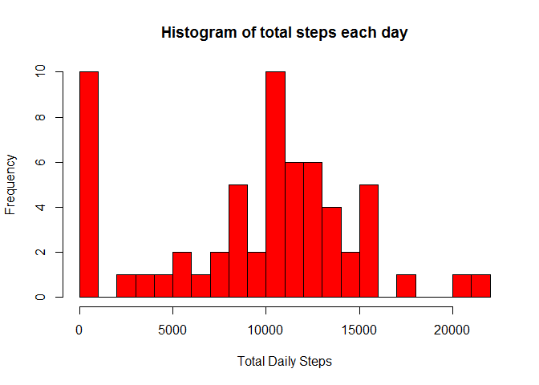
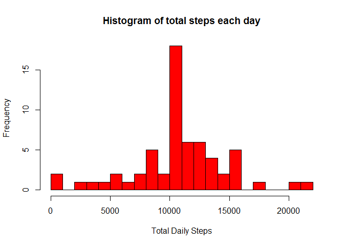
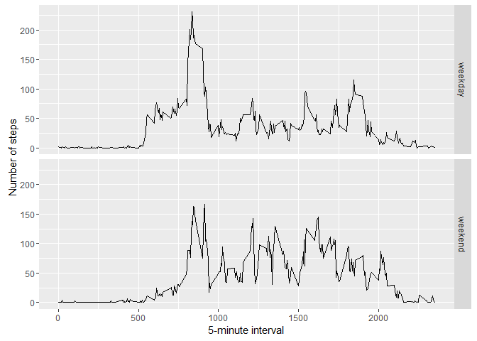

# PA1_template
Asmi Ariv  
June 29, 2016  
##Loading required libraries


```r
library(ggplot2)
```

```
## Warning: package 'ggplot2' was built under R version 3.2.4
```


## Loading data

```r
activity <- read.csv("activity.csv")
```


## The means of total number of steps taken per day

###Calculating the total number of steps taken per day


```r
tota.steps <- tapply(activity$steps, activity$date, sum, na.rm=T)
head(tota.steps)
```

```
## 2012-10-01 2012-10-02 2012-10-03 2012-10-04 2012-10-05 2012-10-06 
##          0        126      11352      12116      13294      15420
```

###Plotting Histogram of the total number of steps taken each day


```r
hist(tota.steps, breaks = 20, col="red", main="Histogram of total steps each day", xlab="Total Daily Steps")
```

<!-- -->

###Calculating mean and media


```r
mean(tota.steps, na.rm=TRUE)
```

```
## [1] 9354.23
```

```r
median(tota.steps, na.rm=TRUE)
```

```
## [1] 10395
```


##Average daily activity pattern

###Plotting the activity pattern


```r
avg <- aggregate(x=list(steps=activity$steps), by=list(interval=activity$interval), FUN=mean, na.rm=T)
ggplot(data=avg, aes(x=interval, y=steps)) +
    geom_line() +
    xlab("5-minute interval") +
    ylab("average number of steps taken")
```

<!-- -->

###Which 5-minute interval contains maximum steps

```r
avg[which.max(avg$steps),]
```

```
##     interval    steps
## 104      835 206.1698
```


##Imputing missing values
###Calculating total number of missing values

```r
missval <- is.na(activity$steps)
table(missval) ## This is also the total number rows with missing values
```

```
## missval
## FALSE  TRUE 
## 15264  2304
```

###Strategy for imputing data

```r
impute.value <- function(steps, interval) {
    impute <- NA
    if (!is.na(steps))
        impute <- c(steps)
    else
        impute <- (avg[avg$interval==interval, "steps"])
    return(impute)
}
```
###New dataset with imputed data

```r
imputed.data <- activity
imputed.data$steps <- mapply(impute.value, imputed.data$steps, imputed.data$interval)
head(imputed.data)
```

```
##       steps       date interval
## 1 1.7169811 2012-10-01        0
## 2 0.3396226 2012-10-01        5
## 3 0.1320755 2012-10-01       10
## 4 0.1509434 2012-10-01       15
## 5 0.0754717 2012-10-01       20
## 6 2.0943396 2012-10-01       25
```

###Plotting histogram with new dataset

```r
totalsteps <- tapply(imputed.data$steps, imputed.data$date, sum)
hist(totalsteps, breaks = 20, col="red", main="Histogram of total steps each day", xlab="Total Daily Steps")
```

<!-- -->

###Calculating mean and media with new dataset


```r
mean(totalsteps)
```

```
## [1] 10766.19
```

```r
median(totalsteps)
```

```
## [1] 10766.19
```

###Meand and media values have gone up after imputing NAs
###Having replaced NAs with the mean based on five-minute intervals, the distribution looks more normal (although little left skewed) and the spike at zero-steps is removed

##Activity patterns between weekdays and weekends

###Creating new variable for "weekdays" and "weekends"

```r
Whichday <- function(date) {
    day <- weekdays(date)
    if (day %in% c("Monday", "Tuesday", "Wednesday", "Thursday", "Friday"))
        return("weekday")
    else if (day %in% c("Saturday", "Sunday"))
        return("weekend")
    else
        stop("invalid date")
}
imputed.data$date <- as.Date(imputed.data$date)
imputed.data$day <- sapply(imputed.data$date, FUN=Whichday)
```

###Plotting the graph according to "weekdays" and "weekends"


```r
avg2 <- aggregate(steps ~ interval + day, data=imputed.data, mean)
ggplot(avg2, aes(interval, steps)) + geom_line() + facet_grid(day ~ .) +
    xlab("5-minute interval") + ylab("Number of steps")
```

<!-- -->


